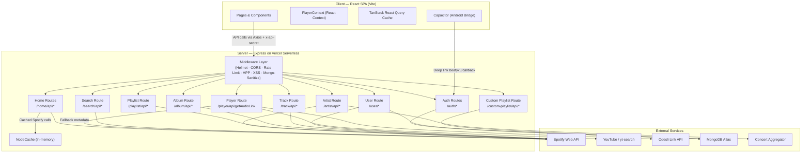
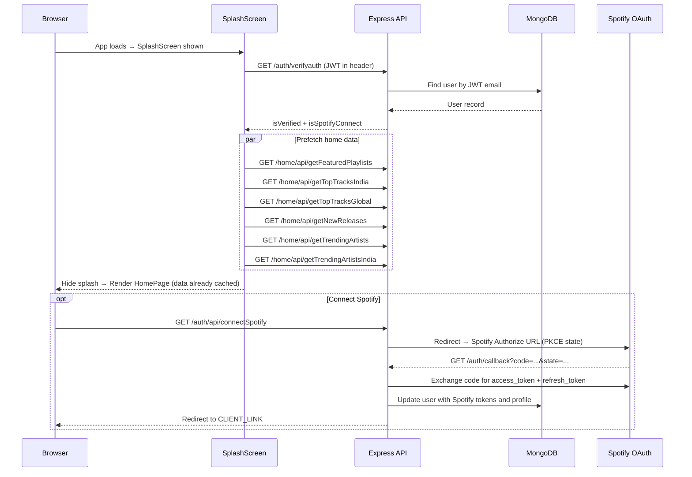
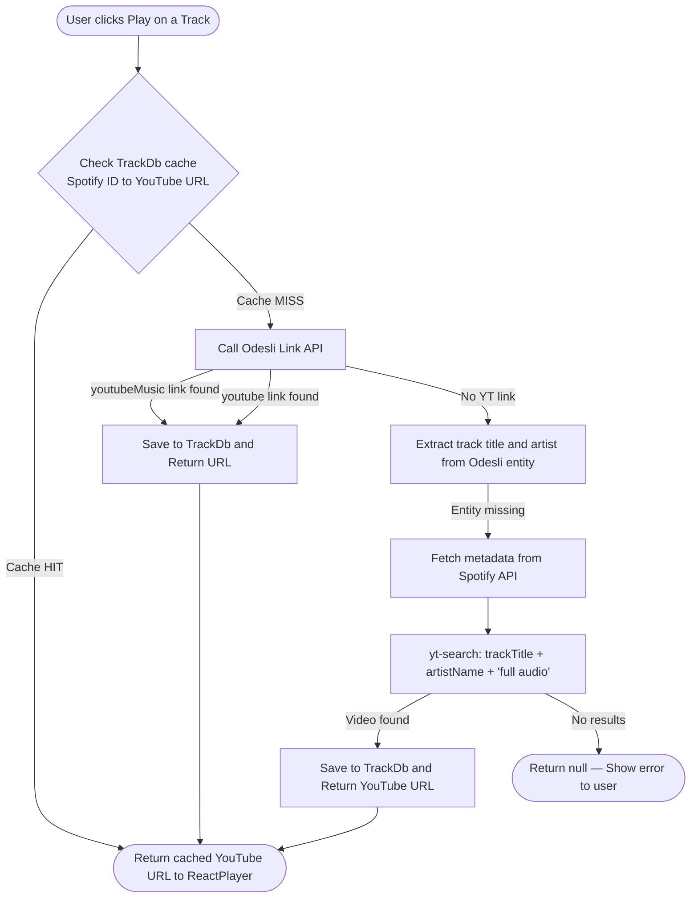
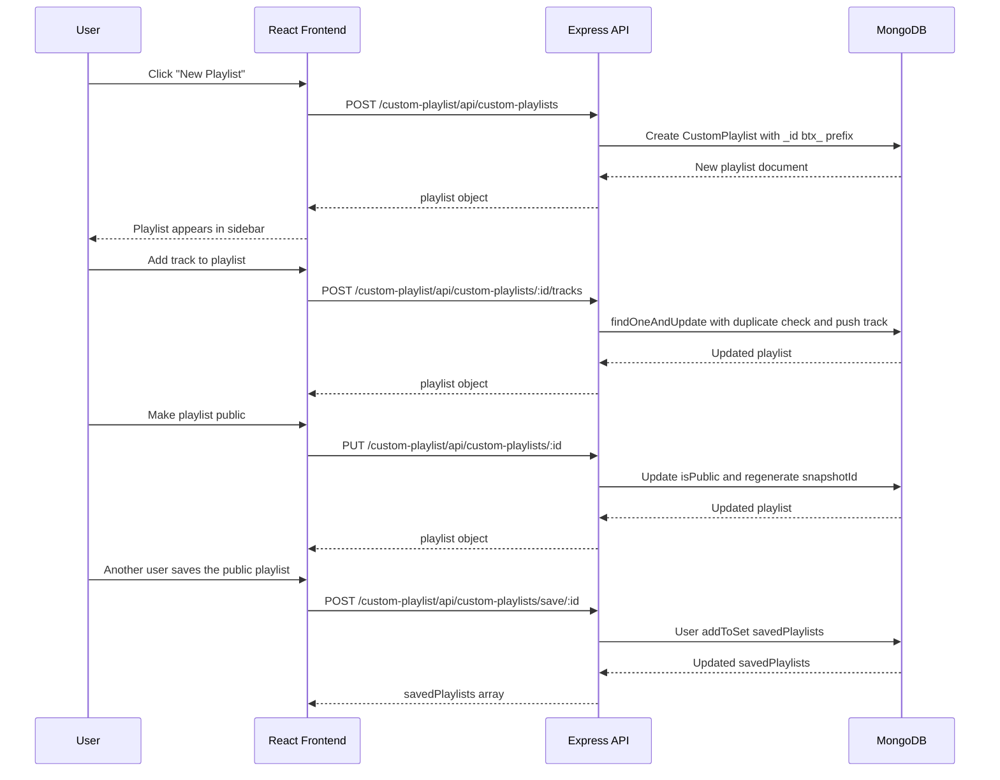

# 🎵 Beatyx — Beat The Bits

<p align="center">
  
</p>

<p align="center">
  <strong>Beatyx</strong> is a full-stack music streaming web application (and Android app) that bridges Spotify's vast catalogue with free audio playback via YouTube. Discover trending tracks, build custom playlists, explore artists and concerts, and stream any song — ad-free — all from a single, polished interface.
</p>

<p align="center">
  <a href="https://beatyx.vercel.app" target="_blank"></a>
  
  
  
  
</p>

---

## 🌐 Live Demo

> **Try it now:** [https://beatyx.vercel.app](https://beatyx.vercel.app)

---

## 📋 Table of Contents

- [Overview](#-overview)
- [Features](#-features)
- [Architecture](#-architecture)
- [Application Flow](#-application-flow)
- [Tech Stack](#-tech-stack)
- [Project Structure](#-project-structure)
- [API Reference](#-api-reference)
- [Database Schema](#-database-schema)
- [Security](#-security)
- [Environment Variables](#-environment-variables)
- [Getting Started](#-getting-started)
- [Code Quality & Tooling](#-code-quality--tooling)
- [Deployment](#-deployment)
- [License](#-license)
- [Acknowledgments](#-acknowledgments)

---

## 🎯 Overview

Beatyx is a **monorepo** containing:

| Directory | Purpose                                                       |
| --------- | ------------------------------------------------------------- |
| `client/` | React + Vite SPA (also packaged as Android app via Capacitor) |
| `server/` | Node.js + Express REST API (deployed on Vercel Serverless)    |

Audio playback works by resolving a **Spotify track ID → YouTube URL** through a multi-step fallback chain (Odesli → Spotify metadata → `yt-search`), then streaming via an embedded `ReactPlayer`. This lets every user stream full tracks without a Spotify Premium subscription.

---

## ✨ Features

| Feature                       | Description                                                                                               |
| ----------------------------- | --------------------------------------------------------------------------------------------------------- |
| 🎧 **Free Streaming**         | Stream any track ad-free via YouTube audio, resolved automatically from Spotify IDs                       |
| 🌍 **Trending Charts**        | Real-time Top-50 India and Global charts powered by Spotify's featured playlists                          |
| 🔍 **Universal Search**       | Search tracks, artists, albums, playlists, and Beatyx-native custom playlists in one place                |
| 🎛️ **Spotify Connect**        | Optional OAuth 2.0 Spotify link unlocks personalised top tracks, saved albums, liked songs, and playlists |
| 🎵 **Custom Playlists**       | Create, edit, share, and save playlists native to Beatyx (stored in MongoDB with `btx_` prefix IDs)       |
| 💜 **Liked Songs**            | Like tracks and access them instantly from a dedicated Liked Songs page                                   |
| 📁 **Saved Albums**           | Save and manage your favourite albums                                                                     |
| 👥 **Artist Follow**          | Follow artists and access a curated feed of who you follow                                                |
| 🎤 **Artist Pages**           | Detailed artist profiles with top tracks, discography, follower count, and trend score                    |
| 🎼 **Album & Playlist Pages** | Full track listings with play-all and queue support                                                       |
| 🎪 **Concerts Discovery**     | Discover upcoming artist shows, filterable by country and artist name                                     |
| 📱 **Mobile App (Android)**   | Packaged as a native Android APK via Capacitor with deep-link OAuth support                               |
| 🔄 **Persistent Queue**       | Track queue, current index, and last-played track survive page refreshes (persisted in `localStorage`)    |
| 🖼️ **Splash Screen**          | Data is prefetched during the animated splash, so the home page loads instantly                           |
| 👤 **User Profiles**          | Update display name, profile picture, view Spotify stats (if connected)                                   |
| ⚙️ **Account Settings**       | Manage account, disconnect Spotify, or delete the account entirely                                        |
| 🔐 **JWT Auth**               | Stateless 30-day JWT auth with bcrypt password hashing                                                    |

---

## 🏗️ Architecture



---

## 🔄 Application Flow

### Auth & Startup Flow



### Audio Playback Resolution Flow



### Custom Playlist CRUD Flow



---

## 🛠️ Tech Stack

### Frontend (`client/`)

| Technology                | Version | Purpose                           |
| ------------------------- | ------- | --------------------------------- |
| **React**                 | 18.3    | UI component library              |
| **Vite**                  | 6.2     | Build tool & dev server           |
| **React Router DOM**      | 6.28    | Client-side routing               |
| **TanStack React Query**  | 5.80    | Server state management & caching |
| **MUI (Material UI)**     | 5.16    | UI component library              |
| **Lucide React**          | 0.514   | Icon set                          |
| **React Player**          | 2.16    | YouTube audio embed               |
| **Axios**                 | 1.7     | HTTP client                       |
| **React Helmet Async**    | 2.0     | SEO `<head>` management           |
| **React GA4**             | 3.0     | Google Analytics 4 tracking       |
| **Vercel Analytics**      | 1.4     | Web vitals & performance          |
| **Vercel Speed Insights** | 1.2     | Core Web Vitals monitoring        |
| **Capacitor**             | 8.4     | Native Android packaging          |
| **Inter (Google Fonts)**  | —       | Primary typeface                  |

### Backend (`server/`)

| Technology                          | Version     | Purpose                                      |
| ----------------------------------- | ----------- | -------------------------------------------- |
| **Node.js**                         | ≥18         | JavaScript runtime                           |
| **Express**                         | 4.21        | Web framework                                |
| **Mongoose**                        | 8.8         | MongoDB ODM                                  |
| **JSON Web Tokens**                 | 9.0         | Stateless auth                               |
| **bcryptjs**                        | 2.4         | Password hashing                             |
| **express-session + connect-mongo** | 1.18 / 6.0  | Server-side sessions (Spotify token storage) |
| **Helmet**                          | 8.1         | HTTP security headers + CSP                  |
| **express-rate-limit**              | 8.2         | Rate limiting (global + auth-specific)       |
| **express-mongo-sanitize**          | 2.2         | NoSQL injection prevention                   |
| **xss-clean**                       | 0.1         | XSS prevention                               |
| **hpp**                             | 0.2         | HTTP Parameter Pollution prevention          |
| **compression**                     | 1.7         | Gzip response compression                    |
| **Morgan**                          | 1.10        | HTTP request logging (tokens redacted)       |
| **node-cache**                      | 5.1         | In-memory response caching                   |
| **Axios + axios-retry**             | 1.7 / 4.5   | Outbound HTTP with retry logic               |
| **youtubei.js / yt-search**         | 17.2 / 2.13 | YouTube audio URL resolution                 |
| **node-youtube-music**              | 0.10        | YouTube Music search                         |
| **Google Generative AI**            | 0.21        | AI integration                               |

### DevOps & Tooling

| Tool                    | Purpose                                       |
| ----------------------- | --------------------------------------------- |
| **Vercel**              | Frontend + Backend serverless deployment      |
| **MongoDB Atlas**       | Managed cloud database                        |
| **ESLint**              | JavaScript/JSX linting                        |
| **Prettier**            | Code formatting                               |
| **Husky + lint-staged** | Pre-commit hook: auto-format & lint on commit |
| **ls-lint**             | Directory/file naming convention enforcement  |

---

## 📁 Project Structure

```
project.beatyx/
├── client/                          # React SPA
│   ├── src/
│   │   ├── assets/styles/           # Global CSS (App.css, index.css)
│   │   ├── components/              # 44 reusable UI components
│   │   │   ├── NavBar.jsx
│   │   │   ├── Side.jsx             # Sidebar (queue, library, navigation)
│   │   │   ├── SectionCard.jsx      # Generic card for tracks/artists/albums
│   │   │   ├── TrackLineCard.jsx    # Track row with play/like/add actions
│   │   │   ├── PlaylistDialogs.jsx  # Create/edit playlist modals
│   │   │   ├── QueueList.jsx        # Playback queue UI
│   │   │   ├── Carousel.jsx         # Horizontal scroll carousel
│   │   │   └── ...
│   │   ├── features/
│   │   │   ├── auth/                # Auth state & verifyAuth service
│   │   │   └── player/              # Player feature (Context, UI, service)
│   │   │       ├── PlayerContext.jsx # Core playback state machine
│   │   │       ├── Player.jsx       # Desktop player bar
│   │   │       ├── CurrentTrack.jsx # Mobile current-track drawer
│   │   │       └── playerService.js # getAudioLink API call
│   │   ├── pages/                   # 19 routed pages
│   │   │   ├── HomePage.jsx
│   │   │   ├── SearchPage.jsx
│   │   │   ├── ArtistPage.jsx
│   │   │   ├── PlaylistPage.jsx
│   │   │   ├── AlbumPage.jsx
│   │   │   ├── TrackPage.jsx
│   │   │   ├── ProfilePage.jsx
│   │   │   ├── AccountSettingsPage.jsx
│   │   │   ├── ConcertsPage.jsx
│   │   │   ├── LikedSongsPage.jsx
│   │   │   ├── PlaylistsPage.jsx
│   │   │   ├── AlbumsPage.jsx
│   │   │   ├── LoginPage.jsx
│   │   │   ├── SignUpPage.jsx
│   │   │   └── ...
│   │   ├── services/
│   │   │   ├── api.js               # Axios instance (base URL + x-api-secret header)
│   │   │   ├── contentService.js    # Home / search / artist / album calls
│   │   │   ├── customPlaylistService.js # Custom playlist CRUD calls
│   │   │   └── userService.js       # Profile, liked songs, follow, albums
│   │   ├── utils/                   # Client-side helpers
│   │   ├── App.jsx                  # Router + Layout + Providers setup
│   │   └── main.jsx                 # React entry point
│   ├── public/                      # Static assets (logo, favicon)
│   ├── android/                     # Capacitor Android project
│   ├── capacitor.config.json        # App ID: com.beatyx.app
│   ├── vite.config.js
│   └── package.json
│
├── server/                          # Express API
│   ├── middlewares/
│   │   ├── verifyAuth.js            # JWT decode + Spotify token refresh
│   │   ├── setToken.js              # Attach access token to session
│   │   ├── verifyApiSecret.js       # x-api-secret header guard
│   │   └── withTokenRetry.js        # Auto-retry on 401 with fresh token
│   ├── models/
│   │   ├── user.js                  # User schema (auth + Spotify + library)
│   │   ├── customPlaylist.js        # btx_ playlist schema
│   │   ├── tracksDb.js              # SpotifyID → YouTube URL cache
│   │   └── uniToken.js              # Shared client-credentials token
│   ├── routes/
│   │   ├── auth.js                  # /auth/* — signup, login, Spotify OAuth
│   │   ├── home.js                  # /home/api/* — charts, categories, concerts
│   │   ├── player.js                # /player/api/getAudioLink/:trackId
│   │   ├── search.js                # /search/api/* — Spotify search
│   │   ├── artist.js                # /artist/api/* — artist info, top tracks
│   │   ├── playlist.js              # /playlist/api/* — Spotify playlist fetch
│   │   ├── album.js                 # /album/api/* — Spotify album fetch
│   │   ├── track.js                 # /track/api/* — Spotify track details
│   │   ├── user.js                  # /user/* — profile, liked songs, follows
│   │   └── customPlaylist.js        # /custom-playlist/api/* — btx_ CRUD
│   ├── utils/
│   │   ├── spotifyApis.js           # Wrapper for all Spotify Web API calls
│   │   ├── getAccessToken.js        # Client-credentials + per-user token logic
│   │   ├── getFreshTokens.js        # Spotify refresh_token → new access_token
│   │   ├── getAudioLink.js          # Odesli → Spotify → yt-search resolution
│   │   ├── getArtistShows.js        # Concert data aggregation
│   │   ├── cache.js                 # NodeCache singleton
│   │   └── connectToDb.js           # Mongoose connection with retry
│   ├── server.js                    # Express app entry point
│   ├── vercel.json                  # Vercel serverless config
│   └── package.json
│
├── .husky/                          # Git hooks (pre-commit lint-staged)
├── .ls-lint.yml                     # File naming rules (PascalCase JSX, camelCase JS)
├── .prettierrc                      # Prettier formatting config
├── eslint.config.js                 # ESLint flat config
└── package.json                     # Root workspace scripts
```

---

## 📡 API Reference

All endpoints are prefixed with the server base URL. Every request (except `/health` and `/auth/*`) must include:

```
x-api-secret: <API_SECRET>
Authorization: Bearer <JWT>   (for protected routes)
```

### Auth (`/auth`)

| Method     | Endpoint                   | Auth | Description                                       |
| ---------- | -------------------------- | ---- | ------------------------------------------------- |
| `POST`     | `/auth/signup`             | —    | Register new user (rate-limited: 10/15 min)       |
| `POST`     | `/auth/login`              | —    | Login, returns JWT                                |
| `GET`      | `/auth/verifyauth`         | JWT  | Verify token validity + Spotify connection status |
| `GET/POST` | `/auth/api/connectSpotify` | JWT  | Initiate Spotify OAuth 2.0 flow                   |
| `GET`      | `/auth/callback`           | —    | Spotify OAuth callback, saves tokens to DB        |

### Home (`/home/api`)

| Method | Endpoint                                 | Description                         |
| ------ | ---------------------------------------- | ----------------------------------- |
| `GET`  | `/home/api/getTopTracksIndia`            | Top 50 tracks in India (cached)     |
| `GET`  | `/home/api/getTopTracksGlobal`           | Top 50 global tracks (cached)       |
| `GET`  | `/home/api/getNewReleases`               | New album/single releases (cached)  |
| `GET`  | `/home/api/getFeaturedPlaylists`         | Spotify featured playlists (cached) |
| `GET`  | `/home/api/getCategories`                | Browse categories                   |
| `GET`  | `/home/api/getCategoryPlaylists/:id`     | Playlists for a category            |
| `GET`  | `/home/api/getTrendingArtists`           | Trending global artists (cached 1h) |
| `GET`  | `/home/api/getTrendingArtistsIndia`      | Trending India artists (cached 1h)  |
| `GET`  | `/home/api/getUserTopItems`              | Personalised top artists & tracks   |
| `GET`  | `/home/api/getConcerts?country=&artist=` | Upcoming concerts discovery         |

### Player (`/player/api`)

| Method | Endpoint                            | Description                      |
| ------ | ----------------------------------- | -------------------------------- |
| `GET`  | `/player/api/getAudioLink/:trackId` | Resolve Spotify ID → YouTube URL |

### Search (`/search/api`)

| Method | Endpoint                      | Description                                         |
| ------ | ----------------------------- | --------------------------------------------------- |
| `GET`  | `/search/api/search?q=&type=` | Search Spotify (tracks, artists, albums, playlists) |

### Artist (`/artist/api`)

| Method | Endpoint                    | Description                      |
| ------ | --------------------------- | -------------------------------- |
| `GET`  | `/artist/api/getArtist/:id` | Artist info + top tracks + shows |

### Playlist (`/playlist/api`)

| Method | Endpoint                        | Description                       |
| ------ | ------------------------------- | --------------------------------- |
| `GET`  | `/playlist/api/getPlaylist/:id` | Spotify playlist details + tracks |

### Album (`/album/api`)

| Method | Endpoint                  | Description                   |
| ------ | ------------------------- | ----------------------------- |
| `GET`  | `/album/api/getAlbum/:id` | Album details + track listing |

### Track (`/track/api`)

| Method | Endpoint                  | Description           |
| ------ | ------------------------- | --------------------- |
| `GET`  | `/track/api/getTrack/:id` | Single track metadata |

### User (`/user`) — JWT Required

| Method   | Endpoint                   | Description                             |
| -------- | -------------------------- | --------------------------------------- |
| `GET`    | `/user/profile`            | Full profile + Spotify data             |
| `PUT`    | `/user/profile-update`     | Update display name / profile picture   |
| `PUT`    | `/user/addLikedSong`       | Add track to liked songs                |
| `PUT`    | `/user/removeLikedSong`    | Remove track from liked songs           |
| `GET`    | `/user/getLikedSongs`      | Fetch liked songs with Spotify metadata |
| `PUT`    | `/user/followArtist`       | Follow an artist                        |
| `PUT`    | `/user/unfollowArtist`     | Unfollow an artist                      |
| `GET`    | `/user/getFollowedArtists` | Fetch followed artists                  |
| `PUT`    | `/user/addSavedAlbum`      | Save an album                           |
| `PUT`    | `/user/removeSavedAlbum`   | Remove a saved album                    |
| `PUT`    | `/user/disconnect-spotify` | Unlink Spotify account                  |
| `DELETE` | `/user/account`            | Delete account permanently              |

### Custom Playlists (`/custom-playlist/api`) — JWT Required

| Method   | Endpoint                                                    | Description                |
| -------- | ----------------------------------------------------------- | -------------------------- |
| `POST`   | `/custom-playlist/api/custom-playlists`                     | Create new playlist        |
| `GET`    | `/custom-playlist/api/custom-playlists/me`                  | My playlists               |
| `GET`    | `/custom-playlist/api/custom-playlists/search?q=`           | Search public playlists    |
| `GET`    | `/custom-playlist/api/custom-playlists/saved/me`            | Saved playlists            |
| `GET`    | `/custom-playlist/api/custom-playlists/:id`                 | Get playlist by ID         |
| `PUT`    | `/custom-playlist/api/custom-playlists/:id`                 | Update playlist metadata   |
| `DELETE` | `/custom-playlist/api/custom-playlists/:id`                 | Delete playlist            |
| `POST`   | `/custom-playlist/api/custom-playlists/:id/tracks`          | Add track                  |
| `DELETE` | `/custom-playlist/api/custom-playlists/:id/tracks/:trackId` | Remove track               |
| `POST`   | `/custom-playlist/api/custom-playlists/save/:id`            | Save/follow a playlist     |
| `DELETE` | `/custom-playlist/api/custom-playlists/save/:id`            | Unsave/unfollow a playlist |

### Health Check

| Method | Endpoint  | Description                          |
| ------ | --------- | ------------------------------------ |
| `GET`  | `/health` | DB connection status + server uptime |

---

## 🗄️ Database Schema

### `User`

```js
{
  displayName:        String (required),
  email:              String (required, unique, indexed),
  password:           String (required, bcrypt hashed),
  profilePic:         String,

  // Spotify Integration
  spotifyId:          String (indexed, sparse),
  spotify_url:        String,
  spotifyAccountType: String,   // "free" | "premium"
  accessToken:        String,
  refreshToken:       String,
  updationTime:       Date,
  country:            String,
  followers:          Number,

  // Library (max 5,000 each)
  likedSongs:         [String],  // Spotify track IDs
  followedArtists:    [String],  // Spotify artist IDs
  savedAlbums:        [String],  // Spotify album IDs
  savedPlaylists:     [String],  // btx_... or Spotify playlist IDs
}
```

### `CustomPlaylist`

```js
{
  _id:         String,   // "btx_<24 hex chars>"
  name:        String (required, max 100 chars),
  description: String,
  ownerId:     ObjectId → User,
  isPublic:    Boolean (default: false),
  snapshotId:  String,   // Updated on every track mutation
  tracks: [{
    id:        String,   // Spotify track ID
    trackName: String,
    artists:   [{ name, id, spotifyUrl }],
    imgSrc:    String,
    duration:  Number,   // ms
    spotifyUrl: String,
  }],
  timestamps: true       // createdAt, updatedAt
}
```

### `TrackDb` — Audio URL Cache

```js
{
  spotifyId:   String (unique),
  youtubeLink: String,
  createdAt:   Date
}
```

### `UniToken` — Shared Client Credentials

```js
{
  accessToken:  String,
  expiresAt:    Date
}
```

---

## 🛡️ Security

| Layer                     | Implementation                                                                                   |
| ------------------------- | ------------------------------------------------------------------------------------------------ |
| **Authentication**        | JWT (30d expiry, `beatyx-api` issuer, `beatyx-client` audience) with `bcryptjs` (saltRounds: 10) |
| **API Gateway**           | Every non-auth request validated via `x-api-secret` header (`verifyApiSecret` middleware)        |
| **Rate Limiting**         | Global: 2,000 req / 15 min; Auth endpoints: 10 req / 15 min                                      |
| **HTTP Headers**          | `helmet` with strict CSP — allows only `self`, Google Fonts, Vercel scripts, Spotify images      |
| **NoSQL Injection**       | `express-mongo-sanitize` strips `$` and `.` from user input                                      |
| **XSS**                   | `xss-clean` sanitises HTML from request body                                                     |
| **HTTP Param Pollution**  | `hpp` prevents duplicate query parameters                                                        |
| **Session Security**      | `httpOnly`, `secure` (production), `sameSite: lax`, 15-min TTL stored in MongoDB                 |
| **CSRF**                  | Spotify OAuth flow uses `crypto.randomBytes(16)` state param validated on callback               |
| **Error Handling**        | Stack traces never exposed to client; 5xx returns a generic message                              |
| **Logging**               | Morgan with `[REDACTED]` token masking in auth header logs                                       |
| **Open Redirect**         | `ALLOWED_REDIRECTS` allowlist enforced before any `res.redirect` in auth flow                    |
| **Spotify ID Validation** | Regex `/^[A-Za-z0-9]{22}$/` applied before any DB write using Spotify IDs                        |

---

## ⚙️ Environment Variables

### Server (`server/.env`)

| Variable         | Description                                     |
| ---------------- | ----------------------------------------------- |
| `MONGO_URI`      | MongoDB Atlas connection string                 |
| `JWT_SECRET`     | Secret key for signing JWTs                     |
| `SESSION_SECRET` | Secret for express-session                      |
| `CLIENT_ID`      | Spotify App client ID                           |
| `CLIENT_SECRET`  | Spotify App client secret                       |
| `REDIRECT_URI`   | Spotify OAuth callback URL (`/auth/callback`)   |
| `CLIENT_LINK`    | Frontend URL (e.g. `https://beatyx.vercel.app`) |
| `API_SECRET`     | Shared secret for `x-api-secret` header         |
| `GET_AUDIO_LINK` | Odesli API base URL                             |
| `VERCEL`         | Set to `"true"` in Vercel deployments           |

### Client (`client/.env`)

| Variable            | Description                    |
| ------------------- | ------------------------------ |
| `VITE_API_BASE_URL` | Server API base URL            |
| `VITE_API_SECRET`   | Must match server `API_SECRET` |

---

## 🚀 Getting Started

### Prerequisites

- Node.js ≥ 18
- npm ≥ 9
- MongoDB Atlas account (or local MongoDB)
- Spotify Developer App ([Create one here](https://developer.spotify.com/dashboard))

### 1. Clone the Repository

```bash
git clone https://github.com/24archit/project.beatyx.git
cd project.beatyx
```

### 2. Install Root Dev Dependencies

```bash
npm install
```

### 3. Setup the Server

```bash
cd server
npm install
cp .env.example .env   # fill in your values
npm run dev            # nodemon server.js → http://localhost:2424
```

### 4. Setup the Client

```bash
cd client
npm install
cp .env.example .env   # set VITE_API_BASE_URL=http://localhost:2424
npm run dev            # Vite → http://localhost:5173
```

### 5. Spotify Developer Setup

1. Go to [Spotify Developer Dashboard](https://developer.spotify.com/dashboard)
2. Create an App → copy **Client ID** and **Client Secret**
3. Add `http://localhost:2424/auth/callback` to **Redirect URIs**
4. Set `CLIENT_ID`, `CLIENT_SECRET`, and `REDIRECT_URI` in `server/.env`

---

## 🧹 Code Quality & Tooling

| Tool            | Config                           | Scope                                                                |
| --------------- | -------------------------------- | -------------------------------------------------------------------- |
| **ESLint**      | `eslint.config.js` (flat config) | JS + JSX with React-specific rules                                   |
| **Prettier**    | `.prettierrc`                    | All JS, JSX, CSS, JSON, MD files                                     |
| **Husky**       | `.husky/`                        | Pre-commit hooks                                                     |
| **lint-staged** | `package.json`                   | Format + lint only staged files on commit                            |
| **ls-lint**     | `.ls-lint.yml`                   | `PascalCase` for `.jsx`/`.css`, `camelCase` for `.js` in `features/` |

Run manually:

```bash
# From root
npm run lint          # ESLint across workspace
npm run format        # Prettier write
npm run lint:structure # ls-lint file naming check
```

---

## 🚢 Deployment

Both the client and server deploy to **Vercel**.

### Client (`client/vercel.json`)

- SPA with catch-all rewrite to `index.html`
- Built with `vite build` → static output in `dist/`

### Server (`server/vercel.json`)

- Serverless function wrapping the Express app
- All routes mapped to `server.js`

### Android App

```bash
cd client
npm run build
npx cap sync android
npx cap open android   # Open in Android Studio → build APK
```

---

## 📝 License

This project is protected under a **Custom Proprietary License**.  
Usage, reproduction, modification, or distribution of the code is **not permitted** without prior written consent from the author.

For further details, see the [LICENSE.txt](./LICENSE.txt) file.

---

## 🙌 Acknowledgments

- **[Spotify](https://developer.spotify.com/)** — for the rich Web API powering metadata, charts, and search
- **[Odesli](https://odesli.co/)** — for the cross-platform music link resolution API
- **[youtubei.js](https://github.com/LuanRT/YouTube.js) & [yt-search](https://github.com/talmobi/yt-search)** — for YouTube audio fallback resolution
- **[Vercel](https://vercel.com/)** — for seamless serverless deployment of both frontend and backend
- **[Capacitor](https://capacitorjs.com/)** — for Android packaging without a separate native codebase
- **Node.js**, **React**, and the wider open-source community
